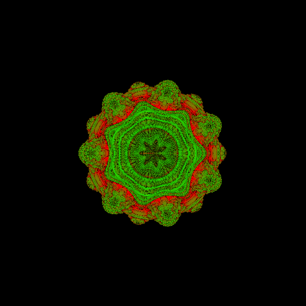

# Mandelbulb Renderer

A Mandelbulb fractal renderer with a Python command-line interface and a Rust computational core. The renderer uses ray marching and can run either sequentially or in parallel with Rayon. It can generate a single PNG image or a 60-frame animated GIF.

## Technologies

- Rust
- Python
- PyO3
- maturin
- uv
- Rayon
- NumPy
- Pillow
- Typer

## Setup

```bash
uv sync
uv run maturin develop --release
uv run python main.py render
```

## Example Commands

```bash
# PNG, parallel mode
uv run python main.py render --parallel --output mandelbulb_parallel

# PNG, sequential mode
uv run python main.py render --no-parallel --output mandelbulb_sequential

# Grayscale PNG
uv run python main.py render --color-mode grayscale --output mandelbulb_gray

# Animated GIF
uv run python main.py render --gif --parallel --output mandelbulb

# Benchmark
uv run python main.py benchmark
```

## Example Images




## Benchmark

Local benchmark output:

```text
$ uv run python main.py benchmark --repeats 20
Warming up...
Running benchmark: 1000x600, repeats=20
[...]
Benchmark results:
Sequential avg: 1.3532s
Parallel avg:   0.1219s
Speedup:        11.10x
```

## CLI Options

- `--width`: output image width in pixels.
- `--height`: output image height in pixels.
- `--power`: Mandelbulb power parameter.
- `--fractal-iterations`: maximum iterations used in fractal distance estimation.
- `--ray-steps`: maximum ray marching steps per ray.
- `--color-mode`: color mode, for example `rgb` or `grayscale`.
- `--gif`: render a 60-frame animated GIF instead of a PNG.
- `--parallel` / `--no-parallel`: enable or disable Rayon parallel rendering.
- `--output`: output filename or basename. The program adds `.png` or `.gif` when no suffix is provided.
